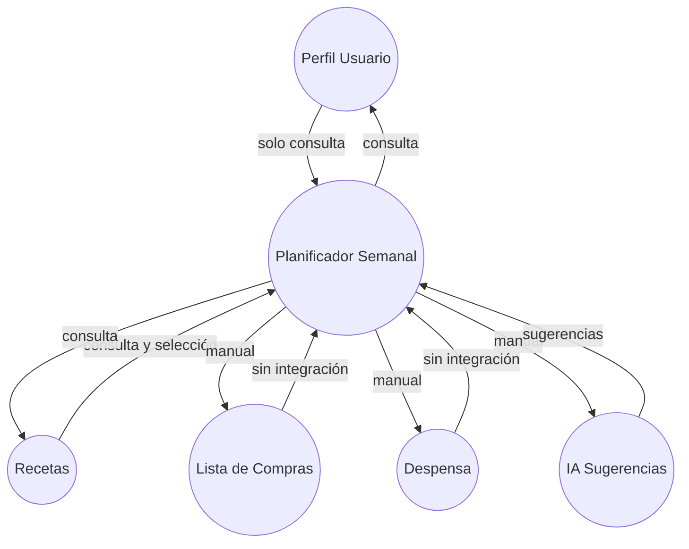
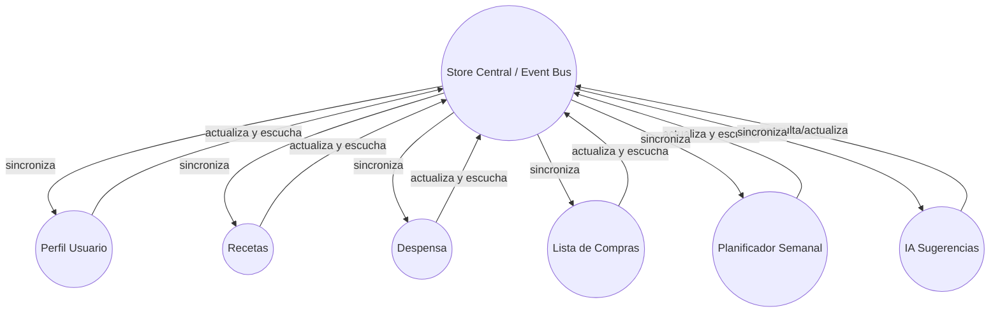
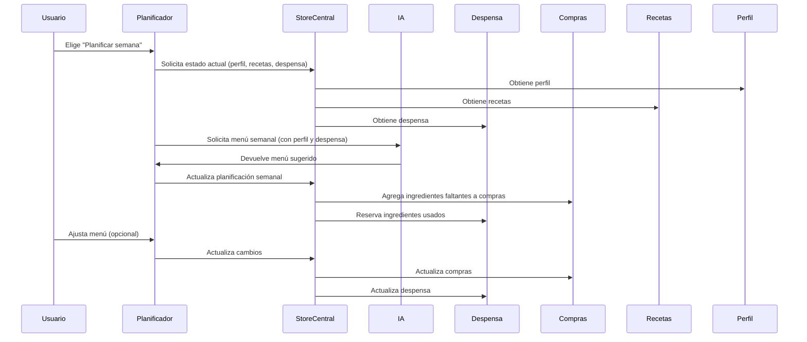

# Auditoría de Integración – Planificador Semanal

## 1. Diagrama de Arquitectura Actual



## 2. Diagrama de Arquitectura Propuesta (Holística)



---

## 3. Flujo de Planificación Holística (Ejemplo)



---

## 4. Prompt tipo para IA (Gemini API gratuita)

```text
Eres un asistente culinario inteligente. El usuario tiene el siguiente perfil:
- Dieta: {dieta}
- Restricciones: {restricciones}
- Electrodomésticos: {electrodomesticos}
- Preferencias: {preferencias}

Su despensa contiene: {ingredientes_despensa}

Sugiere un menú semanal para los siguientes días y horarios:
{dias_y_horarios}

Ten en cuenta:
- No repitas platos a menos que el usuario lo prefiera.
- Solo sugiere recetas que pueda preparar con sus electrodomésticos.
- Explica brevemente por qué sugieres cada receta.
- Si falta algún ingrediente, indícalo.

Formato de respuesta:
Día - Horario: Receta sugerida (explicación breve, ingredientes faltantes si aplica)
```

---

## 5. Resumen visual de integración

- Todos los módulos se sincronizan y reaccionan a cambios a través del store/event bus central.
- La IA utiliza siempre el perfil y la despensa actual.
- El usuario puede ajustar y la app se adapta en tiempo real.

---

**¿Quieres que agregue ejemplos de respuestas de la IA o diagramas de flujos alternativos según el modo (manual vs. autopiloto)?**
