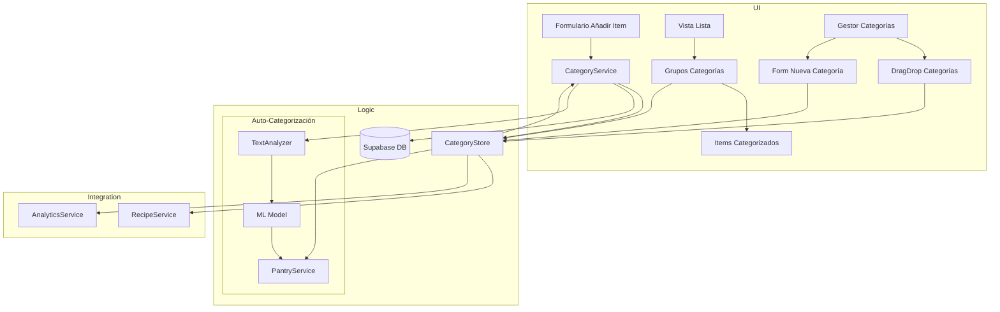
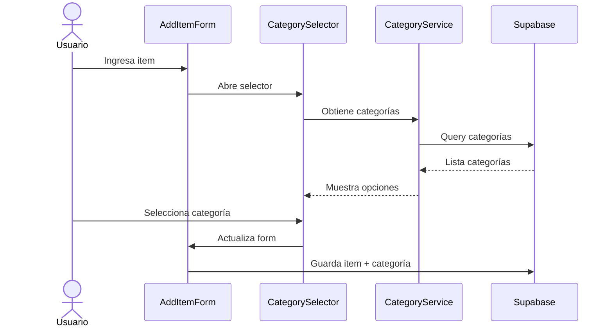
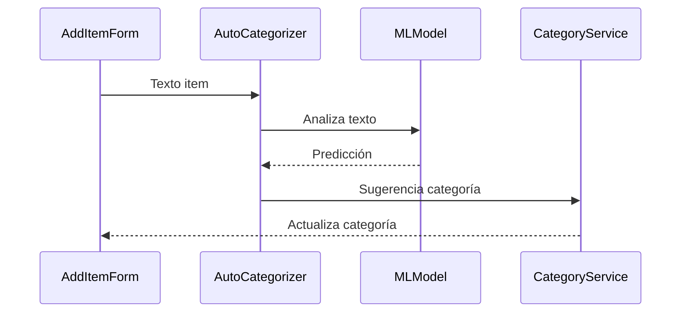

# Arquitectura del Sistema de Categorías

## Diagrama de Flujo


## Estructura de Archivos

```
src/features/shopping-list/
├── components/
│   ├── categories/
│   │   ├── CategorySelector.tsx       # Selector de categorías
│   │   ├── CategoryGroup.tsx         # Grupo de items por categoría
│   │   ├── CategoryManager.tsx       # Modal gestión de categorías
│   │   ├── CategoryForm.tsx          # Formulario nueva categoría
│   │   ├── CategoryIcon.tsx          # Componente icono de categoría
│   │   └── CategoryDragList.tsx      # Lista ordenable de categorías
│   └── items/
│       ├── ItemCard.tsx              # Card de item con categoría
│       └── ItemList.tsx              # Lista de items categorizada
├── services/
│   ├── categoryService.ts            # CRUD categorías
│   ├── autoCategorizer.ts           # Auto-categorización
│   └── categoryAnalytics.ts         # Análisis y estadísticas
├── stores/
│   └── categoryStore.ts             # Estado global categorías
└── types/
    └── categoryTypes.ts             # Tipos y interfaces

src/lib/
└── ml/
    ├── textClassifier.ts            # Clasificador de texto
    └── models/
        └── category-predictor.json   # Modelo entrenado
```

## Flujos de Datos

### 1. Añadir Item con Categoría


### 2. Auto-categorización


## Estados y Store

```typescript
interface CategoryState {
  categories: Category[];
  userCategories: Category[];
  defaultCategories: Category[];
  selectedCategory: string | null;
  loading: boolean;
  error: string | null;
}

interface CategoryActions {
  addCategory: (category: NewCategory) => Promise<void>;
  updateCategory: (id: string, changes: Partial<Category>) => Promise<void>;
  deleteCategory: (id: string) => Promise<void>;
  reorderCategories: (orderedIds: string[]) => Promise<void>;
  predictCategory: (itemName: string) => Promise<string>;
  mergeDuplicates: () => Promise<void>;
}
```

## Integración con Otros Sistemas

### 1. Recetas
- Categorías compartidas entre recetas e items
- Sincronización bidireccional
- Sugerencias basadas en ingredientes

### 2. Despensa
- Categorías consistentes
- Auto-fill de categoría al añadir desde despensa
- Estadísticas cruzadas

### 3. Analytics
- Tracking de uso de categorías
- Análisis de patrones
- Reportes de eficiencia

## Cache y Offline

```typescript
interface CategoryCache {
  timestamp: number;
  categories: Category[];
  version: number;
}

interface OfflineQueue {
  actions: Array<{
    type: 'add' | 'update' | 'delete' | 'reorder';
    payload: any;
    timestamp: number;
  }>;
}
```

## Seguridad y Validación

```typescript
interface CategoryValidation {
  name: {
    minLength: 2,
    maxLength: 50,
    pattern: /^[a-zA-Z0-9\s\-_]+$/
  },
  color: {
    pattern: /^#[0-9A-F]{6}$/i
  },
  icon: string[]; // Lista blanca de iconos permitidos
}
```

## Métricas de Rendimiento

- Tiempo de carga inicial: < 500ms
- Tiempo de categorización: < 100ms
- Memoria máxima: < 5MB
- Cache hit ratio: > 90%
- Precisión auto-categorización: > 85%