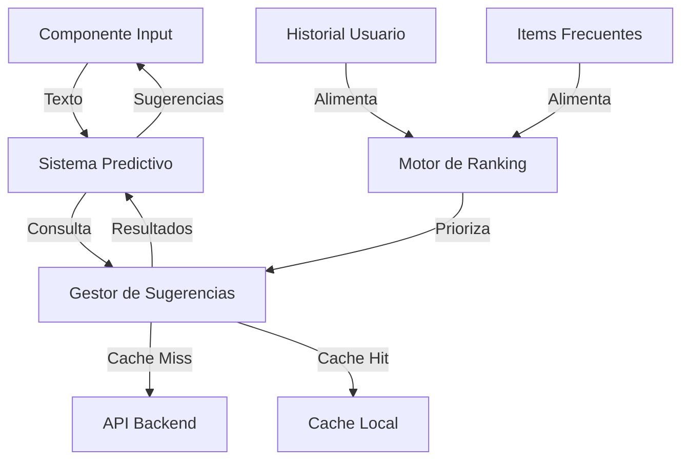

# Plan de Implementación: Sistema Predictivo y Autocompletado

## 1. Arquitectura del Sistema



## 2. Componentes Core

### 2.1 Sistema de Cache Local
```typescript
interface CacheManager {
  // Almacena sugerencias en cache
  set(key: string, suggestions: Suggestion[], ttl?: number): Promise<void>;
  
  // Recupera sugerencias del cache
  get(key: string): Promise<Suggestion[] | null>;
  
  // Invalida entradas específicas
  invalidate(key: string): Promise<void>;
  
  // Limpia cache antiguo
  cleanup(): Promise<void>;
}
```

### 2.2 Motor de Sugerencias
```typescript
interface Suggestion {
  id: string;
  name: string;
  category?: string;
  frequency: number;
  lastUsed?: Date;
  defaultUnit?: string;
  score?: number;
}

class SuggestionEngine {
  // Obtiene sugerencias basadas en input
  async getSuggestions(input: string): Promise<Suggestion[]>;
  
  // Aprende de selecciones del usuario
  async learnFromSelection(item: Suggestion): Promise<void>;
  
  // Actualiza frecuencias y scores
  async updateMetrics(): Promise<void>;
}
```

### 2.3 Componente UI
```typescript
interface SmartInputProps {
  value: string;
  onChange: (value: string) => void;
  onSuggestionSelect: (suggestion: Suggestion) => void;
  suggestions: Suggestion[];
  loading: boolean;
  placeholder?: string;
  className?: string;
}
```

## 3. Plan de Implementación

### Sprint 1: Infraestructura Base (3 días)

#### Día 1: Setup Inicial
1. Crear estructura de archivos
```
src/features/shopping-list/
├── components/
│   ├── SmartInput/
│   │   ├── index.tsx
│   │   ├── types.ts
│   │   └── styles.css
├── lib/
│   ├── cache/
│   │   ├── CacheManager.ts
│   │   └── types.ts
│   ├── suggestions/
│   │   ├── SuggestionEngine.ts
│   │   └── types.ts
└── services/
    └── suggestionService.ts
```

2. Implementar CacheManager básico
3. Crear interfaces base

#### Día 2: Motor de Sugerencias
1. Implementar SuggestionEngine básico
2. Conectar con cache local
3. Implementar algoritmo de ranking

#### Día 3: API y Servicios
1. Crear endpoints necesarios
2. Implementar servicio de sugerencias
3. Integrar con backend existente

### Sprint 2: Componente UI (2 días)

#### Día 1: Componente Base
1. Implementar SmartInput
2. Crear lista de sugerencias
3. Manejar estados de carga

#### Día 2: Interacciones
1. Implementar selección con teclado
2. Añadir destacado de coincidencias
3. Optimizar rendimiento

### Sprint 3: Aprendizaje y Optimización (2 días)

#### Día 1: Sistema de Aprendizaje
1. Implementar tracking de selecciones
2. Crear sistema de puntuación
3. Optimizar algoritmo de ranking

#### Día 2: Refinamiento
1. Mejorar precisión de sugerencias
2. Optimizar caché
3. Implementar tests

## 4. Detalles Técnicos

### 4.1 Algoritmo de Ranking
```typescript
interface RankingFactors {
  frequency: number;    // Frecuencia de uso
  recency: number;      // Uso reciente
  exactMatch: number;   // Coincidencia exacta
  categoryMatch: number;// Coincidencia de categoría
}

class RankingEngine {
  calculateScore(suggestion: Suggestion, input: string): number {
    const factors = this.calculateFactors(suggestion, input);
    return this.computeWeightedScore(factors);
  }
}
```

### 4.2 Gestión de Cache
```typescript
interface CacheConfig {
  ttl: number;         // Tiempo de vida
  maxEntries: number;  // Máximo de entradas
  cleanupInterval: number; // Intervalo de limpieza
}

class CacheStrategy {
  async shouldCache(key: string, value: any): Promise<boolean>;
  async shouldInvalidate(key: string): Promise<boolean>;
}
```

## 5. Tests

### 5.1 Tests Unitarios
```typescript
describe('SuggestionEngine', () => {
  test('debería retornar sugerencias relevantes', async () => {
    // ...
  });
  
  test('debería aprender de selecciones', async () => {
    // ...
  });
});
```

### 5.2 Tests de Integración
```typescript
describe('SmartInput Integration', () => {
  test('debería mostrar sugerencias al escribir', async () => {
    // ...
  });
  
  test('debería seleccionar sugerencia con teclado', async () => {
    // ...
  });
});
```

## 6. Métricas de Éxito

### 6.1 Performance
- Tiempo de respuesta < 100ms
- Cache hit rate > 80%
- Memoria utilizada < 5MB

### 6.2 Precisión
- Relevancia de sugerencias > 90%
- Tasa de uso de sugerencias > 60%
- Tasa de error < 1%

## 7. Plan de Rollout

### 7.1 Fase Alpha
1. Testing interno
2. Recolección de datos iniciales
3. Ajuste de algoritmos

### 7.2 Fase Beta
1. 20% de usuarios
2. Monitoreo de métricas
3. Ajustes basados en uso real

### 7.3 Release General
1. Despliegue gradual
2. Monitoreo continuo
3. Optimizaciones basadas en datos

## 8. Próximos Pasos

1. Iniciar setup del proyecto
2. Implementar CacheManager
3. Desarrollar componente SmartInput base
4. Comenzar con tests unitarios