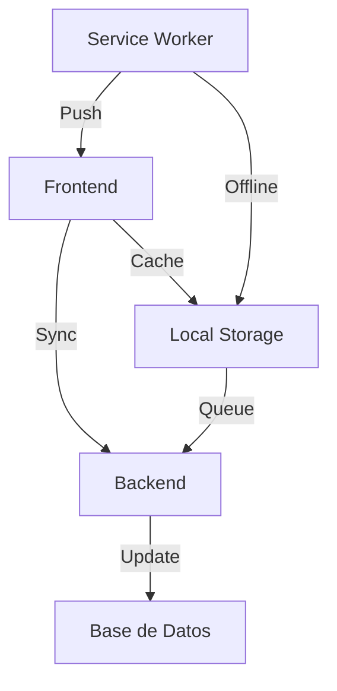

# Análisis de Flujo de Usuario - Lista de Compras

## 1. Análisis de Situación Actual

### 1.1 Funcionalidades Principales
- Añadir items manualmente
- Gestión de cantidades y unidades
- Categorización de productos
- Búsqueda de precios en tiempo real
- Vista de mapa de tiendas
- Reordenamiento por drag & drop
- Marcado de items comprados
- Items frecuentes de acceso rápido

### 1.2 Puntos Fuertes
- Interfaz intuitiva y organizada
- Categorización efectiva de productos
- Integración de precios y ubicaciones
- Sistema de drag & drop funcional
- Gestión eficiente de items comprados

### 1.3 Puntos de Mejora Identificados
- Tiempo de carga inicial de datos
- Experiencia en modo offline
- Sincronización con despensa
- Gestión de múltiples listas
- Colaboración entre usuarios
- Historial de precios limitado

## 2. Simulación de Flujos de Usuario

### 2.1 Flujo Principal: Crear Lista de Compras
```mermaid
sequenceDiagram
    Usuario->>+Lista: Accede a la página
    Lista->>+Backend: Carga datos iniciales
    Backend-->>-Lista: Devuelve items y categorías
    Usuario->>Lista: Añade nuevo item
    Lista->>Backend: Guarda item
    Usuario->>Lista: Busca precios
    Lista->>API Precios: Consulta precios
    API Precios-->>Lista: Devuelve resultados
    Usuario->>Lista: Ve mapa de tiendas
    Lista->>Backend: Consulta ubicaciones
    Backend-->>-Lista: Devuelve datos de tiendas
```

### 2.2 Puntos de Fricción Identificados
1. **Entrada de Datos**
   - Múltiples clicks para añadir item completo
   - Duplicación de esfuerzo al añadir items frecuentes
   - Selección manual de categorías

2. **Búsqueda de Precios**
   - Tiempo de espera en resultados
   - Falta de persistencia de histórico
   - Navegación entre modal y lista principal

3. **Gestión de Lista**
   - Reordenamiento limitado a misma categoría
   - Sin filtros avanzados
   - Sin agrupación por tienda

4. **Sincronización**
   - Sin manejo de conflictos offline
   - Pérdida de cambios en mala conexión
   - Sin respaldo automático

## 3. Propuesta de Optimizaciones

### 3.1 Mejoras de UX Inmediatas
1. **Entrada Inteligente**
   - Autocompletado predictivo
   - Detección automática de unidades
   - Sugerencias contextuales

2. **Gestión de Datos**
   - Caché local agresivo
   - Sincronización en background
   - Cola de operaciones offline

3. **Interacción**
   - Gestos táctiles expandidos
   - Accesos rápidos personalizados
   - Vista compacta/detallada

### 3.2 Optimizaciones Técnicas


1. **Performance**
   - Lazy loading de componentes
   - Virtualización de listas largas
   - Compresión de datos

2. **Arquitectura**
   - Estado local robusto
   - Sistema de eventos
   - Cola de sincronización

## 4. Métricas de Éxito

### 4.1 KPIs Cuantitativos
- Tiempo medio de creación de item
- Tasa de uso de funciones offline
- Velocidad de carga inicial
- Tasa de conversión de búsqueda a compra

### 4.2 KPIs Cualitativos
- Satisfacción de usuario
- Facilidad de uso
- Confiabilidad percibida
- Utilidad de sugerencias

## 5. Próximos Pasos

1. **Fase 1: Optimización Base**
   - Implementar caché local
   - Mejorar sistema de entrada
   - Optimizar rendimiento

2. **Fase 2: Características Avanzadas**
   - Sincronización robusta
   - Integración con despensa
   - Sistema de plantillas

3. **Fase 3: Experiencia Social**
   - Compartir listas
   - Colaboración en tiempo real
   - Recomendaciones comunitarias