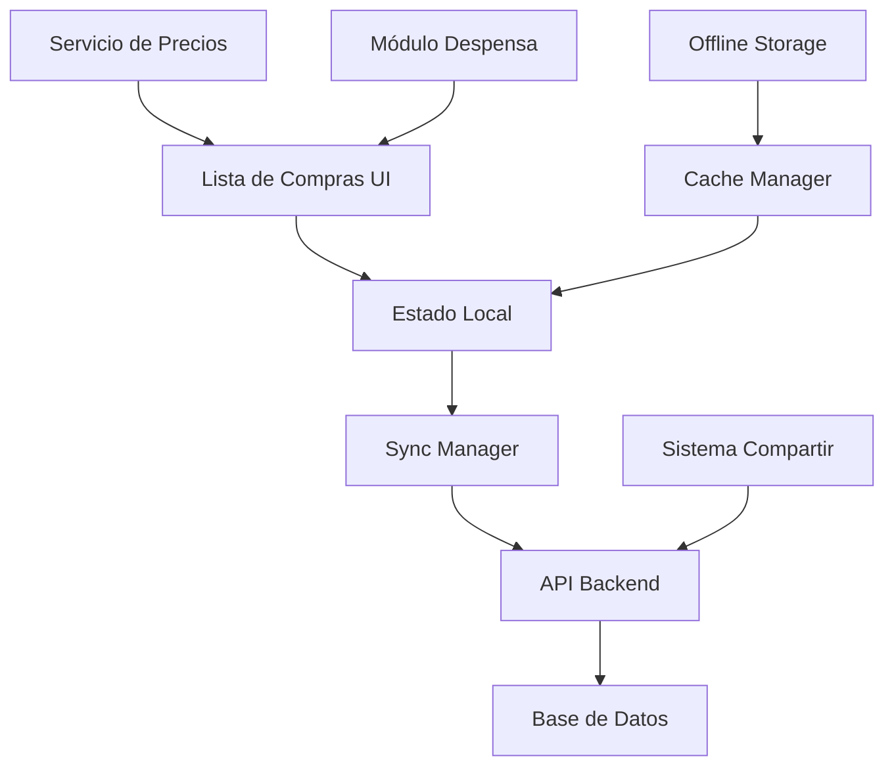

# Plan de Mejora: Lista de Compras

## 1. Análisis del Estado Actual

### 1.1 Funcionalidades Existentes
- Agregar items manualmente con cantidad y unidad
- Marcar items como comprados
- Búsqueda de precios en tiempo real
- Items frecuentes como acceso rápido
- Gestión básica de lista (agregar, eliminar, marcar)

### 1.2 Limitaciones Identificadas
- No hay categorización de items
- Búsqueda de precios separada de los items
- Sin estimación de costos totales
- Sin capacidad de compartir listas
- Sin integración profunda con la despensa
- Sin soporte offline
- Sin historial de precios

## 2. Mejoras Propuestas

### 2.1 Mejoras de UX/UI
1. **Reorganización de Interfaz**
   - Mover búsqueda de precios a un botón contextual por item
   - Implementar vista por categorías
   - Añadir modo de ordenamiento (por nombre, fecha, categoría)

2. **Interacción Mejorada**
   - Drag & drop para reordenar items
   - Swipe actions en móvil
   - Filtros rápidos (pendientes, comprados, por categoría)

### 2.2 Nuevas Funcionalidades

1. **Gestión de Listas**
   - Plantillas de listas predefinidas
   - Compartir listas con otros usuarios
   - Historial de listas anteriores
   - Modo colaborativo en tiempo real

2. **Integración con Precios**
   - Historial de precios por producto
   - Estimación de costo total de la lista
   - Comparación de precios entre tiendas
   - Alertas de ofertas en productos frecuentes

3. **Integración con Despensa**
   - Sugerencias automáticas basadas en inventario bajo
   - Sincronización con items agotados
   - Actualización automática de despensa al marcar como comprado

4. **Funcionalidad Offline**
   - Sincronización local
   - Cola de cambios pendientes
   - Caché de precios recientes

## 3. Arquitectura Propuesta

### 3.1 Componentes Principales

1. **UI Layer**
   - Componentes modulares por funcionalidad
   - Estado local con React Context/Redux
   - Sistema de caché para datos frecuentes

2. **Data Layer**
   - Sistema de sincronización bidireccional
   - Caché local con IndexedDB
   - Queue de operaciones offline

3. **Integration Layer**
   - Conectores para servicios externos
   - Sistema de eventos para actualizaciones
   - APIs para compartir datos

## 4. Plan de Implementación

### Fase 1: Mejoras Fundamentales (2-3 semanas)
- Reorganización de UI
- Implementación de categorías
- Sistema de ordenamiento
- Mejoras en la búsqueda de precios

### Fase 2: Funcionalidades Avanzadas (3-4 semanas)
- Sistema de plantillas
- Historial de listas
- Estimación de costos
- Integración básica con despensa

### Fase 3: Características Sociales (2-3 semanas)
- Compartir listas
- Modo colaborativo
- Notificaciones
- Permisos de usuario

### Fase 4: Optimización y Offline (2-3 semanas)
- Implementación de caché
- Sincronización offline
- Optimización de rendimiento
- Testing y depuración

## 5. Consideraciones Técnicas

### 5.1 Performance
- Implementar virtualización para listas largas
- Caché agresivo para datos de precios
- Lazy loading de imágenes y datos no críticos

### 5.2 Seguridad
- Validación de permisos para listas compartidas
- Encriptación de datos sensibles
- Rate limiting en búsquedas de precios

### 5.3 Escalabilidad
- Arquitectura modular para facilitar extensiones
- Sistema de plugins para integraciones futuras
- APIs versionadas

## 6. KPIs y Métricas

- Tiempo promedio de creación de lista
- Tasa de uso de funciones offline
- Precisión de sugerencias automáticas
- Engagement con características sociales
- Satisfacción del usuario (NPS)

## 7. Próximos Pasos

1. Priorizar features basados en feedback de usuarios
2. Crear prototipos de UI para validar cambios
3. Establecer ambiente de pruebas
4. Desarrollar plan de migración de datos
5. Definir estrategia de rollout por fases