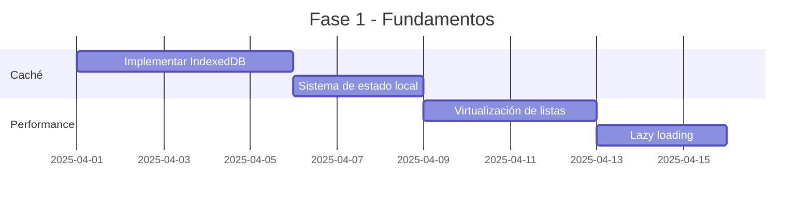
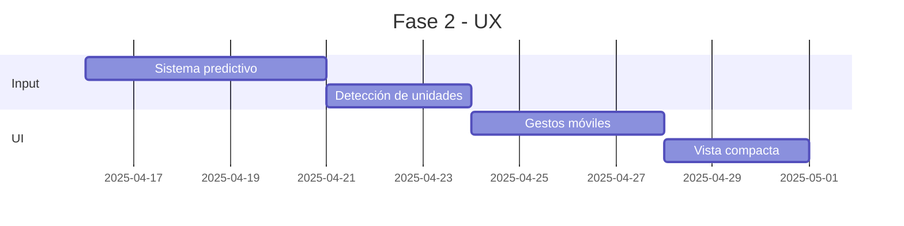
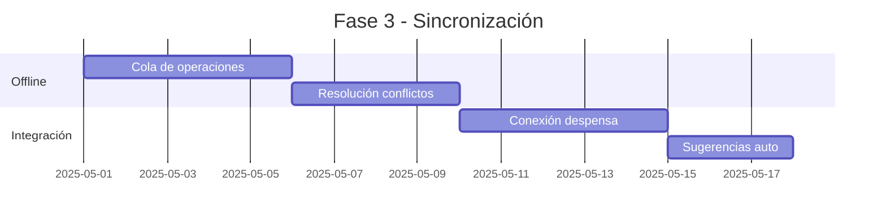
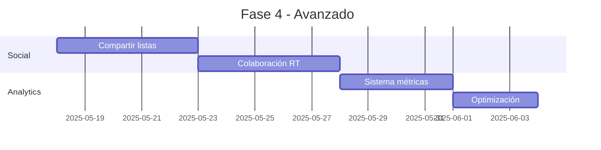
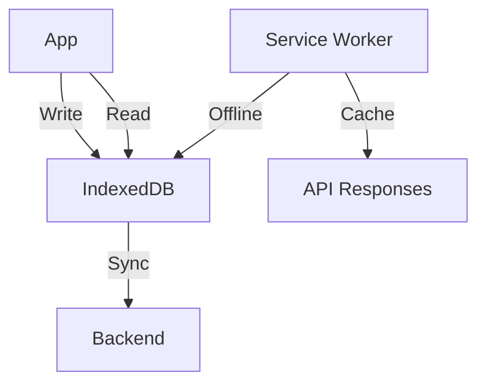
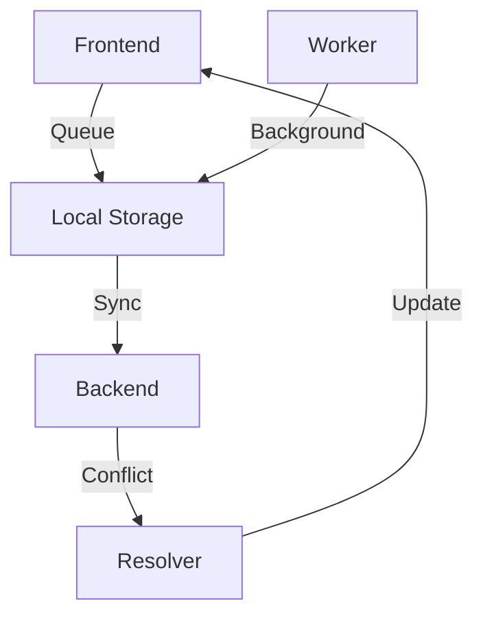

# Plan de Optimización - Lista de Compras

## 1. Priorización de Mejoras

### Matriz de Priorización
| Mejora | Impacto Usuario | Complejidad Técnica | Dependencias | Prioridad |
|--------|----------------|-------------------|--------------|-----------|
| Caché local | Alto | Media | Ninguna | P0 |
| Autocompletado | Alto | Baja | Caché | P1 |
| Sincronización offline | Alto | Alta | Caché | P1 |
| Integración despensa | Medio | Media | Caché | P2 |
| Sistema social | Medio | Alta | Sync offline | P3 |

## 2. Plan de Implementación

### Fase 1: Fundamentos (Sprint 1-2)

#### Objetivos
1. **Sistema de Caché Local**
   - Implementar IndexedDB para almacenamiento
   - Crear sistema de estado local robusto
   - Establecer políticas de caché

2. **Optimización de Performance**
   - Implementar virtualización para listas largas
   - Añadir lazy loading de componentes
   - Optimizar carga inicial

### Fase 2: Experiencia de Usuario (Sprint 3-4)

#### Objetivos
1. **Mejora de Entrada de Datos**
   - Implementar autocompletado predictivo
   - Añadir detección automática de unidades
   - Crear sugerencias contextuales

2. **Optimización de UI**
   - Implementar gestos táctiles
   - Añadir vista compacta/detallada
   - Mejorar navegación

### Fase 3: Sincronización (Sprint 5-6)

#### Objetivos
1. **Funcionalidad Offline**
   - Implementar cola de operaciones
   - Añadir resolución de conflictos
   - Crear sistema de sincronización

2. **Integración con Despensa**
   - Conectar con sistema de despensa
   - Implementar sugerencias automáticas
   - Crear actualizaciones bidireccionales

### Fase 4: Características Avanzadas (Sprint 7-8)

#### Objetivos
1. **Características Sociales**
   - Implementar sistema para compartir listas
   - Añadir colaboración en tiempo real
   - Crear sistema de permisos

2. **Analytics y Optimización**
   - Implementar sistema de métricas
   - Crear dashboard de analytics
   - Optimizar basado en datos

## 3. Detalles de Implementación

### 3.1 Sistema de Caché

### 3.2 Arquitectura de Sincronización

## 4. Métricas de Éxito

### 4.1 KPIs Técnicos
- Tiempo de carga < 2s
- Sincronización exitosa > 98%
- Caché hit rate > 90%
- Offline availability > 95%

### 4.2 KPIs de Usuario
- Reducción tiempo de entrada 50%
- Satisfacción usuario > 4.5/5
- Uso funciones offline > 30%
- Adopción nuevas features > 60%

## 5. Plan de Rollout

### 5.1 Estrategia de Despliegue
1. **Fase Alpha**
   - Testing interno
   - 10% usuarios beta
   - Recolección feedback

2. **Fase Beta**
   - 50% usuarios
   - Monitoreo performance
   - Ajustes basados en métricas

3. **Release General**
   - 100% usuarios
   - Soporte dedicado
   - Documentación completa

### 5.2 Plan de Contingencia
- Rollback automatizado
- Monitoreo 24/7
- Equipo de respuesta rápida

## 6. Siguientes Pasos Inmediatos

1. **Preparación (Semana 1)**
   - Setup ambiente desarrollo
   - Configuración herramientas
   - Definición de estándares

2. **Inicio Fase 1 (Semana 2)**
   - Implementación IndexedDB
   - Setup sistema de estado
   - Primeras optimizaciones

3. **Review y Ajuste**
   - Validación con stakeholders
   - Ajuste de timelines
   - Definición de milestones