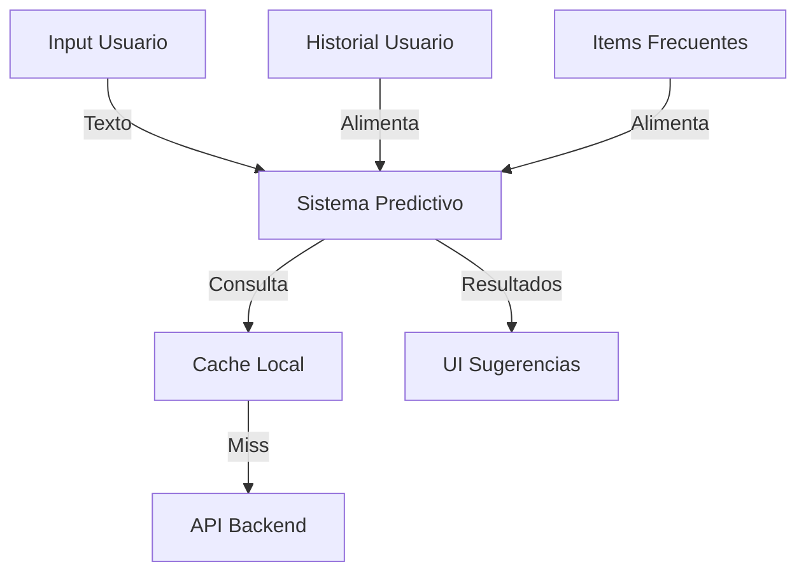
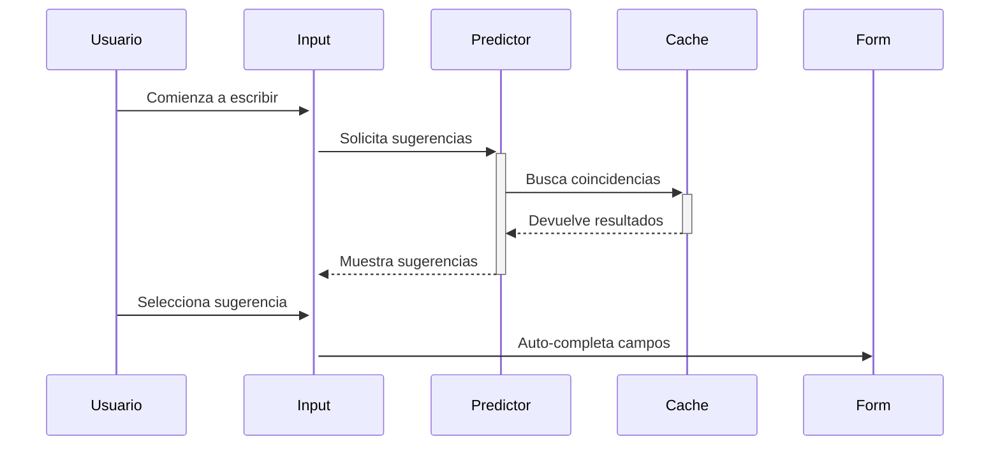

# Plan de Implementación: Mejoras de UX en Lista de Compras

## 1. Visión General

Este plan detalla la implementación de mejoras en la experiencia de usuario de la lista de compras, centrándose en el sistema de entrada inteligente y optimizaciones de UI.

## 2. Arquitectura del Sistema

### 2.1 Sistema Predictivo


### 2.2 Flujo de UI Mejorado


## 3. Plan de Implementación

### 3.1 Sistema de Entrada Inteligente

#### Sprint 1: Base Predictiva (1 semana)
1. **Sistema de Sugerencias**
   ```typescript
   interface Suggestion {
     name: string;
     category?: string;
     frequency: number;
     lastUsed?: Date;
     defaultUnit?: string;
   }

   class PredictiveSystem {
     async getSuggestions(input: string): Promise<Suggestion[]>;
     async learnFromSelection(item: Suggestion): void;
     async updateFrequencies(): void;
   }
   ```

2. **Caché de Sugerencias**
   - Implementar almacenamiento local
   - Sistema de invalidación
   - Priorización de resultados

#### Sprint 2: Detección Inteligente (1 semana)
1. **Parser de Unidades**
   ```typescript
   interface ParsedInput {
     name: string;
     quantity?: number;
     unit?: string;
     category?: string;
   }

   class InputParser {
     parseInput(raw: string): ParsedInput;
     detectUnit(text: string): string | null;
     inferCategory(text: string): string | null;
   }
   ```

2. **Sistema de Aprendizaje**
   - Registro de patrones comunes
   - Adaptación a preferencias de usuario
   - Mejora continua de sugerencias

### 3.2 Optimización de UI

#### Sprint 3: Mejoras Visuales (1 semana)
1. **Vista Compacta/Detallada**
   ```typescript
   interface ViewMode {
     type: 'compact' | 'detailed';
     itemsPerPage: number;
     showExtraInfo: boolean;
   }
   ```

2. **Gestos Móviles**
   - Swipe para acciones rápidas
   - Pull-to-refresh
   - Gestos de reordenamiento

#### Sprint 4: Interacciones Avanzadas (1 semana)
1. **Accesos Rápidos**
   - Botones de acción contextual
   - Atajos de teclado
   - Menú de acciones frecuentes

2. **Feedback Visual**
   - Animaciones de transición
   - Indicadores de progreso
   - Estados de carga optimizados

## 4. Componentes Clave

### 4.1 Smart Input
```typescript
interface SmartInputProps {
  onSuggestionSelect: (suggestion: Suggestion) => void;
  onInputChange: (value: string) => void;
  suggestions: Suggestion[];
  loading: boolean;
}
```

### 4.2 Quick Actions
```typescript
interface QuickAction {
  id: string;
  icon: ReactNode;
  label: string;
  action: () => void;
  shortcut?: string;
}
```

## 5. Plan de Testing

### 5.1 Tests Unitarios
- Parsing de entrada
- Lógica de sugerencias
- Detección de unidades

### 5.2 Tests de Integración
- Flujo completo de entrada
- Sincronización de caché
- Interacciones de UI

### 5.3 Tests de Usabilidad
- Tiempo de completado de tareas
- Tasa de error en entrada
- Satisfacción de usuario

## 6. Métricas de Éxito

### 6.1 Métricas Cuantitativas
- Tiempo de entrada reducido en 50%
- Precisión de sugerencias > 80%
- Tasa de uso de sugerencias > 60%

### 6.2 Métricas Cualitativas
- Satisfacción de usuario
- Facilidad de uso
- Intuitividad de la interfaz

## 7. Plan de Rollout

### 7.1 Fase Alpha (1 semana)
1. Testing interno
2. Feedback del equipo
3. Ajustes iniciales

### 7.2 Fase Beta (1 semana)
1. 20% de usuarios
2. Monitoreo de métricas
3. Ajustes basados en feedback

### 7.3 Release General
1. 100% de usuarios
2. Monitoreo continuo
3. Soporte y mantenimiento

## 8. Próximos Pasos

1. **Inmediatos**
   - Setup del ambiente de desarrollo
   - Implementación del sistema base de sugerencias
   - Desarrollo de prototipos de UI

2. **Siguientes**
   - Testing con usuarios
   - Refinamiento de algoritmos
   - Optimización de performance